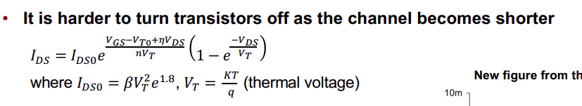

# MOSFETS Physics
- Three operating modes
  - Cutoff (off)
    - Vgs < Vt
  - Linear (on)
    - Vgs >= Vt, Vds < Vgs - Vt
  - Saturation (on)
    - Vgs >= Vt, Vds >= Vgs - Vt
## Long Channel MOSFETS
- Characteristics
    - Gate capacitence
      - Cg = e0 * W * L
    - Drain source current
      - Ids = Qc / t
      - Ids (linear) = un * Cox * (W/L) * [(Vgs - Vt) - (Vds / 2)] * Vds
      - Ids (saturation) = un * Cox * (W/2L) * (Vgs -Vt)^2
    - Charge in channel
      - Cg * (Vgc - Vt)
      - In linear region, Vc ~= (Vs + Vd) / 2
      - Vgc = Vgs - (Vds / 2)
    - Time for charge to cross channel
      - t = L/vn = L / (un * E) = L^2 / (un * Vds)

## Short Channel MOSFETS
- Below micrometer range
- Assumptions made above about Ids are no longer true
- Effects
  - Channel length modulation
    - Effective channel length gets shorter as Vds increases
    - Channel L is reduced by deltL
    - deltL = sqrt(Vds - Vdsat)
    - Current in saturation is now:
      - Ids = un * Cox * (W/2L) * (Vgs - Vt)^2 * (1 + lambda * Vds)
      - lambda = channel modulation factor
      - 1/lambda = early voltage
  - Mobility degradation
    - Electric field attracts carries to edge of surface, lowering mobility
    - ueff = u0 / (1 + n * (Vgs - Vt))
  - Velocity saturation
    - v = (un * E) / (1 + E / Ec) for E < Ec
    - v = vsat for E >= Ec
    - Device might now saturate at Vds > Vdsat
      - Vdsat = Leff vsat / ueff
    - Linear:
      - equation remains the same
    - Saturation:
      - Idsat = vsat * Cox * W * [(Vgs - Vt) - (Vdsat / 2)] * (1 + lambda * Vds)
  - Threshold voltage effects: body effect
    - If Vsb is not 0, the threshold voltage will change
      - As Vsb increases, |Vt| increases for NMOS and PMOS
    - Drain can help by effectively lowering threshold voltage. DIBL effect
  - Leakage: sub-threshold current and gate leakage
    - Current is never really cut-off completely
    - Increases exponentially from Vgs, Vds, and temperature 
    - 3 major mechanisms are
      - Subthreshold conduction between source and drain (primary mechanism)
      - 
      - Gate leakage to body
      - Junction leakage. (source or drain to body)
  - Temperature effects
    - Mobility decreases with temperature
## MOS Capacitance
- Time required to chare/discharge capacitances is the main component delay in CMOS circuits
- Primary capacitance is gate to body, but there are capacitances between every terminal
- Gate capacitances
  - We like gate to body but not the others
  - Cutoff:
    - Charge from gate is matched with charge from body
  - Linear:
    - Split between gate/source and gate/drain
  - Saturation:
    - Gate/source has most of the capacitance
- Diffusion capacitances
  - formed by depletion regions between wells and body
  - Dependent on surface of depletion region around source or drain

## CMOS
- Noise margins
  - NMl = Vil - Vol
  - NMh = Voh - Vih
- Propogation delay
  - Time from 50% in to 50% out
  - Increases combinational delay
- Rise and Fall time
  - Time between output 90% and 10%
- Pullup and Pulldown networks should be equal strength
  - NMOS is stronger than PMOS for same width
- Vout = Vdd (1 - e ^(-t/RC))
  - Where R is the equivalent resistance of the active network
    - R = Vdd / (2Idsat)
  - Where C is the output capacitance of the gate
- Static power consumption
  - Subthreshold leakage is primary
- Short circuit power consumption
  - Happens during the time both networks are on
- Dynamic power consumption
  - Happensn when switching
  - Pavg = Vdd * Iavg
  - Iavg = (C * Vdd) / T
  - Pavg = (C * Vdd^2) / T = C * Vdd^2 * f
  - This equation is usually multiplied by some activity factor because not all transistors are flipping all the time
  - Can decouple parts of  your design to operate at different voltages and frequencies in order to minimize power consumption or maximize performance
  - 